# User Guide

Welcome to the GamiBot User Guide. This guide explains how to use GamiBot in Moodle and describes its main study support features, based on artificial intelligence and gamification.

## Table of Contents

1.  [Overview](#overview)
2.  [How to Access](#how-to-access)
3.  [Features](#features) 
   - [3.1 Create Quizzes](#create-quizzes)
   - [3.2 Summarize Content](#summarize-content)
   - [3.3 Clarify Doubts](#clarify-doubts)

## Overview

GamiBot is a virtual assistant integrated into Moodle, designed to support students throughout their learning journey. Through a simple and intuitive chat interface, GamiBot allows users to interact using natural language and quickly access study support features.

Its main features include quiz generation, content summarization, doubt clarification, and student progress visualization.

## How to Access

To access GamiBot:

1. Go to the course page in Moodle;
2. Locate the GamiBot chat icon in the lower-right corner of the screen;
3. Click the icon to open the interaction window.

<figure style="text-align: center;">
  

    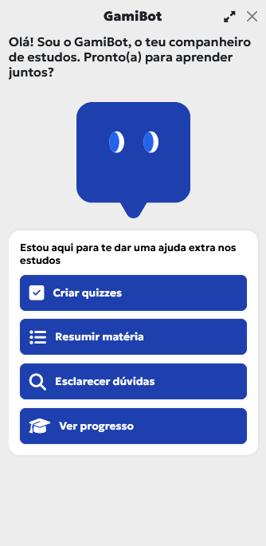    
  

  <figcaption>Main GamiBot interface</figcaption>
</figure>

From this point on, you can directly select the desired feature or type a question in the text field.

## Features

GamiBot provides four main features, displayed directly in the initial interface:

### Create Quizzes

This feature allows users to generate interactive quizzes based on the course content. Quizzes help test knowledge, reinforce concepts, and promote self-assessment, making them a useful tool for continuous study and exam preparation.

The process begins with GamiBot asking the user about:
- The desired **quiz type** (e.g., *True/False* or *Multiple Choice*);
- The **topic** on which the quiz should be created.

#### Quiz Execution, Feedback, and Lives

After selecting the quiz type, the user indicates the topic to be tested (e.g., *Rules of chess pieces*). Based on this information, GamiBot automatically generates a set of questions appropriate to the chosen topic.

<figure style="text-align: center;">
  

    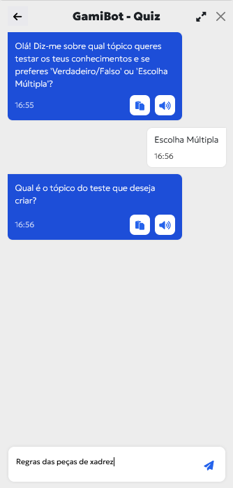
    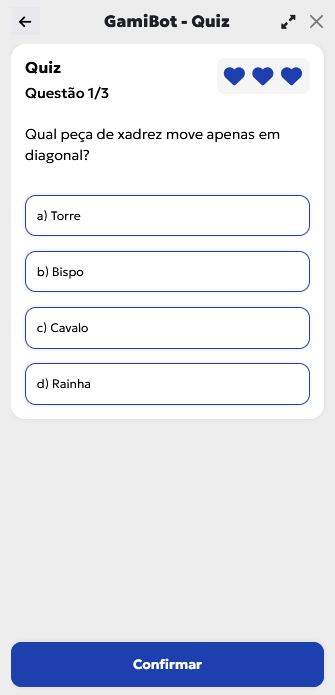
    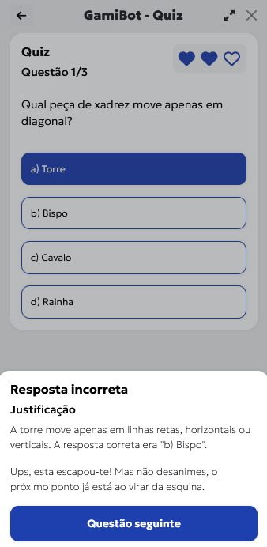
  

  <figcaption>Quiz generation</figcaption>
</figure>

Each question is answered directly in the interface by selecting the desired option and confirming the answer. Regardless of whether the answer is correct or incorrect, GamiBot provides **immediate feedback**, including:
- Indication of the answer result;
- An **explanatory justification**, reinforcing learning;
- Motivational messages encouraging quiz continuation.

The quiz also includes a **lives system**, represented by visual icons. By default, each user starts with **3 lives**. A life is lost whenever an incorrect answer is given. The number of lives is **configurable by the administrator/instructor**.

#### Final Results and Progress

At the end of the quiz, GamiBot presents a **summary of the user’s performance**, including the given answer, the correct answer, an explanatory justification reinforcing key concepts, and personalized study suggestions to improve future performance.

<figure style="text-align: center;">
  

    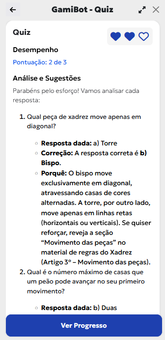
    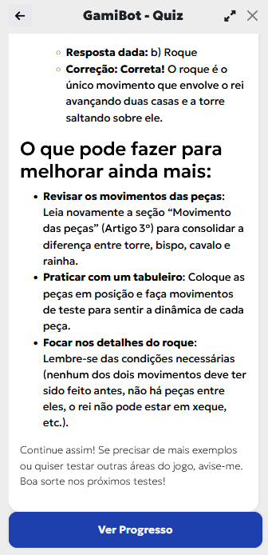
    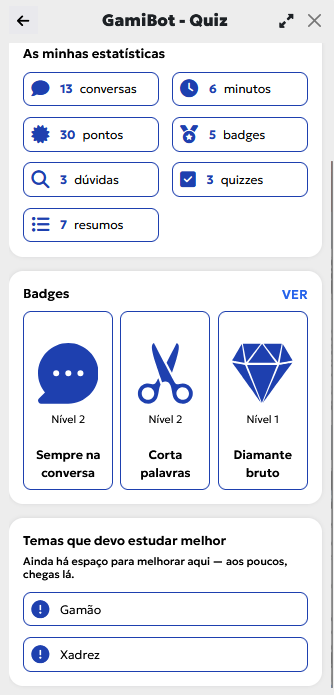
  

  <figcaption>Quiz results and feedback</figcaption>
</figure>

Users can also access the **View Progress** area, where the following information is displayed:
- Usage statistics (interactions, time spent, completed quizzes);
- Accumulated points and earned badges;
- Progress levels and unlocked achievements;
- Topics that require further attention.

### Summarize Content

The **Summarize Content** feature allows users to obtain automatic and structured summaries of course materials through a simple chat-based interaction. GamiBot asks for the **topic** to be summarized and, based on the materials available in Moodle, generates a summary focused on the essential concepts.

<figure style="text-align: center;">
  

    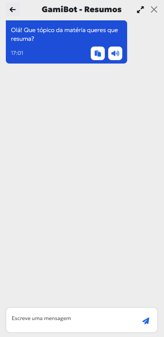
    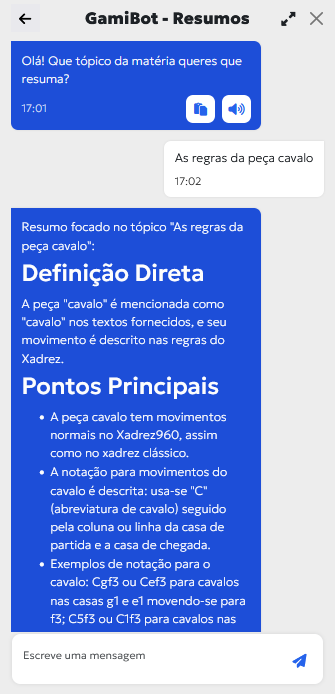    
  

  <figcaption>Summarize content</figcaption>
</figure>

Summaries are presented in a clear and organized manner, including:
- Direct definitions of key concepts;
- A list of the most important points;
- Illustrative examples, whenever applicable.

This feature is especially useful for content review, learning consolidation, and exam preparation.

### Clarify Doubts

The **Clarify Doubts** feature allows users to ask questions in natural language about course content. GamiBot analyzes the question and responds based on the materials available in Moodle, providing clear and contextualized explanations, which may include definitions, examples, and references to supporting course documents.

<figure style="text-align: center;">
  

    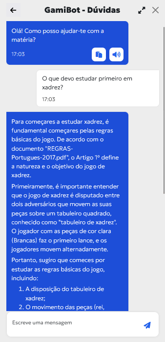
  

  <figcaption>Clarify doubts</figcaption>
</figure>

This feature is particularly useful for:
- Clarifying theoretical concepts;
- Supporting autonomous study;
- Guiding students on where to start or what to review;
- Providing quick access to relevant information.

In this way, GamiBot acts as an immediate study support tool, available at any time.

### Gamification

GamiBot integrates a set of **gamification mechanisms** aimed at increasing student motivation, engagement, and active participation throughout the learning process.

Through interaction with GamiBot, users accumulate:
- **Points**, awarded for actions such as asking questions, creating quizzes, or consulting summaries;
- **Badges**, which recognize different types of participation and achievements;
- **Levels**, reflecting continuous engagement and progression.

<figure style="text-align: center;">
  

    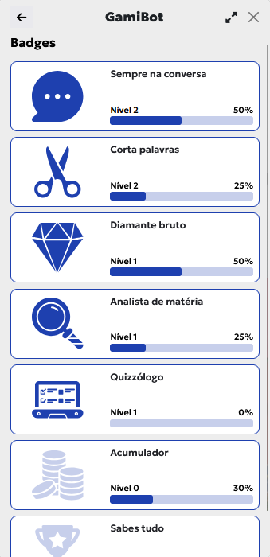
    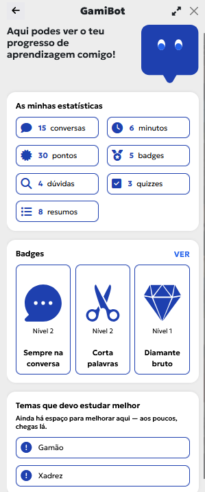    
  

  <figcaption>Gamification</figcaption>
</figure>

The progress area also allows users to view:
- Usage statistics (conversations, interaction time, quizzes, summaries, and doubts);
- Earned badges and their respective progression levels;
- Topics that require further improvement, supporting learning self-regulation.

These mechanisms transform interaction with GamiBot into a more engaging experience, encouraging continuous study and progressive performance improvement.
